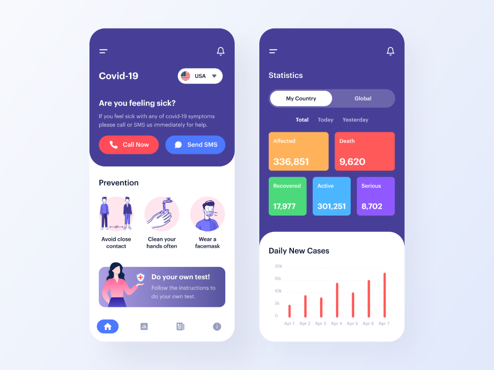
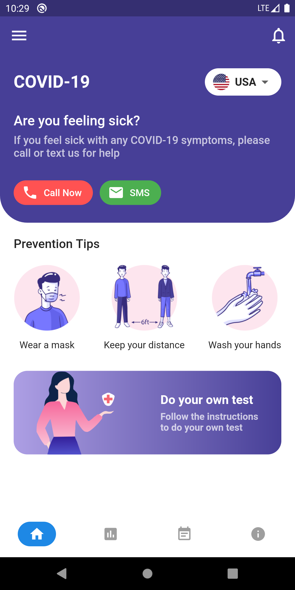
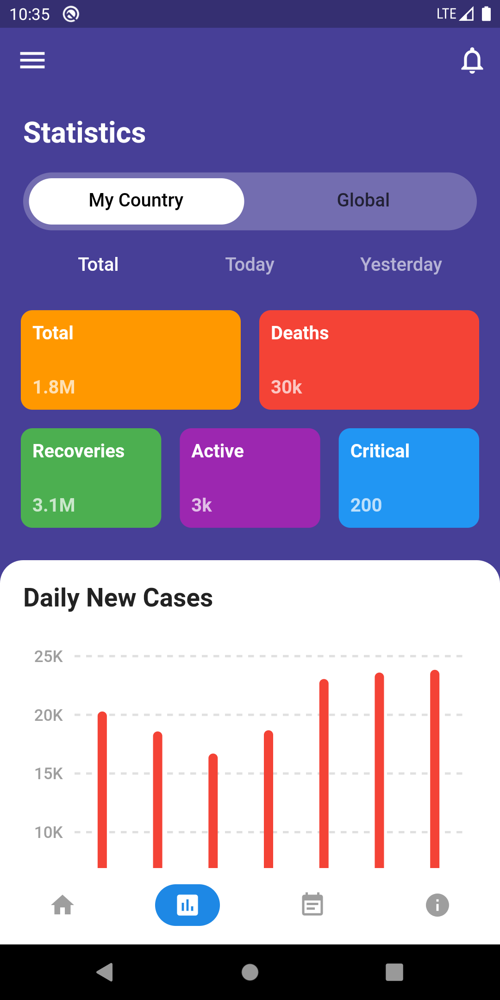

# Covid19 Dashboard
I found this UI from internet, I don't know who is the real owner of this design, So I can't credit anyone. If this is your design thank you.
 
### Languages & tools :
[][android]
[][dart]
[][flutter]
  

|Covid19-Dashboard Original | Covid19-Dashboard Home | Covid19-Dashboard Stats | 
|------|-------|-------|
|||

### Directory Structure :

    |-- covid19_dashboard
    |    |-- android
    |    |   |-- app
    |    |   |-- gradle
    |    |   |-- build.gradle
    |    |   |-- gradle.properties
    |    |   |-- gradlew
    |    |   |-- gradlew.bat
    |    |   |-- local.properties
    |    |   |-- settings.gradle
    |    |   
    |    |-- assets
    |    |   |-- images
    |    |       |-- cn_flag.png
    |    |       |-- distance.png
    |    |       |-- fr_flag.png
    |    |       |-- in_flag.png
    |    |       |-- it_flag.png
    |    |       |-- mask.png
    |    |       |-- own_test.png
    |    |       |-- uk_flag.png
    |    |       |-- us_flag.png
    |    |       |-- wash_hands.png
    |    |
    |    |-- lib
    |    |   |-- config
    |    |   |   |-- palette.dart
    |    |   |   |-- style.dart
    |    |   |   
    |    |   |-- data
    |    |   |   |-- data.dart
    |    |   |   
    |    |   |-- screens
    |    |   |   |-- bottomNavScreen.dart
    |    |   |   |-- calendarScreen.dart
    |    |   |   |-- homeScreen.dart
    |    |   |   |-- screen.dart
    |    |   |   |-- statsScreen.dart
    |    |   |
    |    |   |-- widgets
    |    |   |   |-- countryDropdown.dart
    |    |   |   |-- covidChat.dart
    |    |   |   |-- customAppBar.dart
    |    |   |   |-- statsGrid.dart
    |    |   |   |-- widgets.dart
    |    |   |-- main.dart
    |    |
    |    |-- test
    |        |-- widget_test.dart
    |
    |-- Icon
    |    |-- androidstudio.png
    |    |-- dart.png
    |    |-- flutter.png
    |
    |-- Img
    |    |-- Covid19DashBoard1.png
    |    |-- Covid19DashBoard2.png
    |    |-- Og.png
    |
    |-- README.md

### Connect with me :  

    
 

[website]: https://abhilashtuofficial.github.io/
[instagram]: https://www.instagram.com/abhilash_tu/
[dart]: https://github.com/AbhilashTUofficial/CloneApps
[flutter]: https://github.com/AbhilashTUofficial/CloneApps
[android]: https://github.com/AbhilashTUofficial/CloneApps

